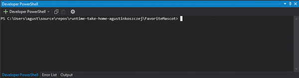

# FavoriteMascot

## The exercise

The [exercise](https://github.com/agustinkoszczej/FavoriteMascot/blob/master/exercise.md) was resolved using **.NET 5** programming language.

## Guidance

1. .NET 5 SDK/Runtime installed.
    1. You may also try running the exercise using Docker *(haven't tried since I don't currently have it installed on my computer)*
2. You can run the project with one or many filepaths. For example:
```bash
dotnet run input.json
```
*or*
```bash
dotnet run example_1.json example_2.json [...]
```
 
## Notes
 
- Source code it's located in [Program.cs](https://github.com/agustinkoszczej/FavoriteMascot/blob/master/FavoriteMascot/Program.cs)
- Consider to have your files in same folder where you'll run this code
- Only dependency used is `Newtonsoft.Json` *(popular json framework for .NET)* for deserializing the file

## Some screens

### One json result


*`input.json` result is Earnie*

### Multiple json results

